# 🌑 Umbra

**Provably Fair Blackjack on Solana with Zero-Knowledge Proofs**

**Decentralized, trustless casino gaming powered by Noir ZK circuits and ShadowWire privacy**

Check out the live demo of **Umbra**: 👉 [Click here to try it out](https://zkumbra.vercel.app)

>This application uses Zero-Knowledge Proofs (Noir) to ensure fairness without revealing the deck, and ShadowWire for private transactions.

## The ZK Casino Experience 🎲

Umbra is built as a decentralized application (dApp) on Solana, optimized for trustless gameplay. The interface provides a seamless, casino-like experience where every shuffle, deal, and reveal is cryptographically proven.

<p align="center">
  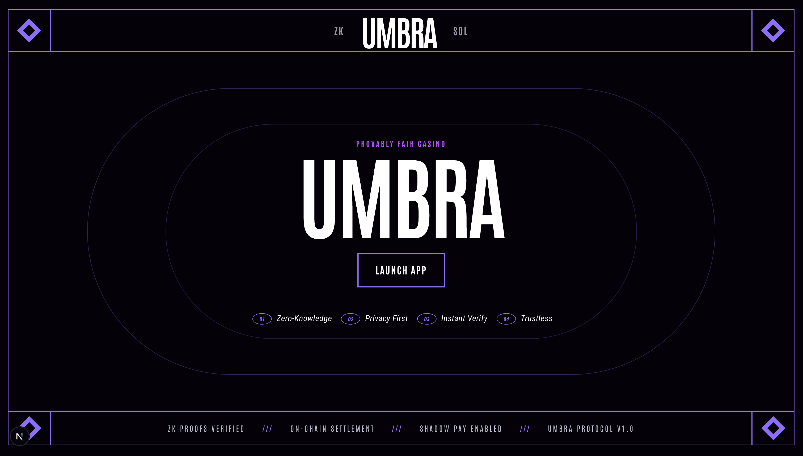
  <br/>
  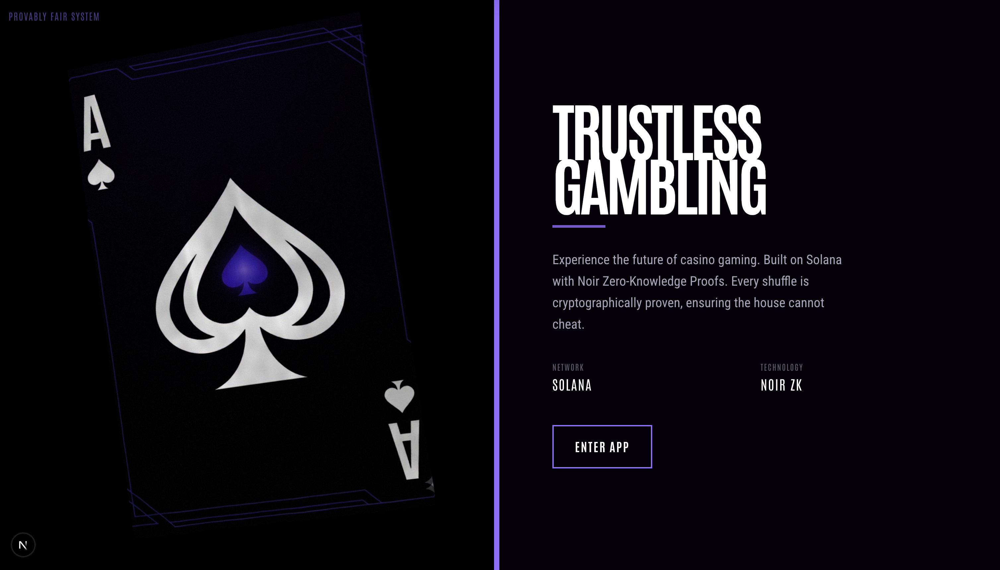
  <br/>
  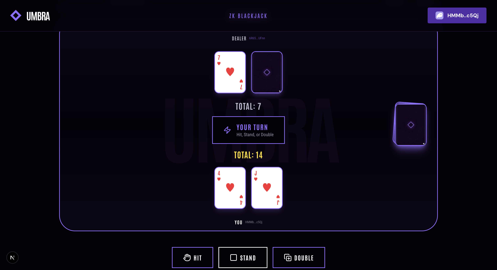
  <br/>
  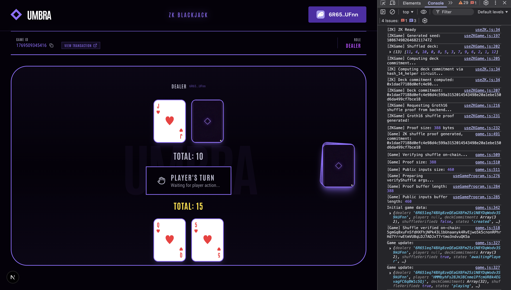
</p>

## Grand Vision vs. Hackathon Scope 🔭

**The Grand Vision:** A full-suite, decentralized ZK Casino where every game (Poker, Roulette, Slots) is provably fair and privacy-preserving.

**Hackathon Scope:** For the **Solana Privacy Hack**, we have implemented the core infrastructure and a fully functional **Blackjack** game to demonstrate the power of ZK shuffles and private betting.

## Inspiration: How We Came Up With This Idea 💡

We noticed that online gambling is still plagued by a fundamental problem: **Trust**.
- How do you know the server isn't cheating?
- "Provably Fair" systems often rely on server seeds that the casino knows.
- Players have to trust the house with their funds and game integrity.
- Transactions are public, exposing financial history.

> *"What if you could play Blackjack where the deck is encrypted, and even the dealer doesn't know the order of cards until they are dealt?"*

That question sparked Umbra. By combining **Zero-Knowledge Proofs (Noir)** with **Solana's speed** and **ShadowWire's privacy**, we created a platform where:
- The deck is shuffled locally by the dealer.
- A ZK proof guarantees the shuffle is fair *without revealing the cards*.
- Cards are dealt as encrypted commitments.
- Values are only revealed when needed (e.g., after a player hits), preventing both parties from cheating.

This exploration led us to build Umbra as a **Solana dApp** that:

- **Proves fairness mathematically** using Noir circuits (Groth16)
- **Encrypts the deck** with Poseidon hashing
- **Enables private betting** using ShadowWire SDK
- **Executes game logic on-chain** with Anchor smart contracts
- **Verifies proofs instantly** using on-chain verifiers
- **Works seamlessly** with Phantom/Backpack wallets

## Features ✨

### 1. **Cryptographic Shuffle (Zero-Knowledge)**
- The dealer performs a **cryptographically secure shuffle** locally using a Fisher-Yates algorithm seeded with true randomness.
- A ZK proof (`shuffle_proof`) is generated to prove the deck is a valid permutation of cards (0-12) without revealing the order.
- The proof is verified on-chain, ensuring the deck is mathematically fair before any card is dealt.

> **Note:** The current implementation uses a **13-card deck (single suit)** to stay within Solana's transaction size limits. Full 52-card support is planned for future optimization.

### 2. **Trustless Dealing**
- Cards are dealt as **encrypted commitments** (hashes).
- Neither the player nor the dealer knows the value of the next card.
- Prevents the dealer from "stacking the deck" or the player from peeking.

### 3. **Commit-Reveal Gameplay**
- **Player Action**: When a player hits, they commit to taking the next card *before* knowing its value.
- **Dealer Reveal**: The dealer must then reveal the card value with a ZK proof (`reveal_proof`) that matches the commitment.
- Ensures fairness for both sides.

### 4. **Private Betting (ShadowWire)**
- Integrated with ShadowWire SDK.
- Players can place bets without exposing their wallet balance or transaction history on-chain.
- Winnings are settled privately.

### 5. **Multiplayer-Ready**
- Join a game using a unique Game ID.
- Play remotely against a dealer.
- Real-time game state updates via Solana account subscriptions.

## Getting Started 🚀

### Frontend Setup

Clone the repository and start the development server:

```bash
git clone <repo-url>
cd umbra
npm install
npm run dev
```

### Environment Variables

Create a `.env.local` file in the root directory:

```env
# SOLANA NETWORK SETTINGS
# Mainnet - for ShadowWire privacy payments (Using Helius RPC)
NEXT_PUBLIC_SOLANA_NETWORK=mainnet-beta
NEXT_PUBLIC_RPC_ENDPOINT=https://mainnet.helius-rpc.com/?api-key=<YOUR_HELIUS_API_KEY>

# Devnet - for Game Programs (shuffle/deal/reveal verification)
NEXT_PUBLIC_DEVNET_RPC_ENDPOINT=https://api.devnet.solana.com

# SHADOWWIRE SETTINGS
NEXT_PUBLIC_SHADOWWIRE_ENABLED=true
NEXT_PUBLIC_HOUSE_WALLET_ADDRESS=<HOUSE_WALLET_PUBKEY>
```

### Smart Contract Deployment

Deploy the Anchor programs (if running your own instance):

```bash
anchor build
anchor deploy
```

## System Architecture 🏗️

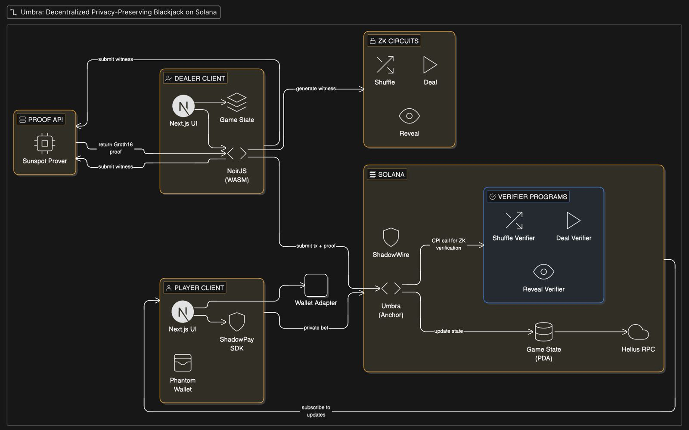

## Technical Gameplay Flow 🎮

### Phase 1: Game Creation

The dealer creates a new game by shuffling the deck locally and generating a ZK proof that the shuffle is valid.

```mermaid
sequenceDiagram
    autonumber
    participant D as 🎰 Dealer
    participant B as 🌐 Browser (NoirJS)
    participant API as ⚙️ Backend (/api/prove)
    participant S as ⛓️ Solana

    Note over D,S: PHASE 1: GAME CREATION

    D->>B: Click "Create Game"

    rect rgb(40, 40, 60)
        Note over B: Local Cryptographic Operations
        B->>B: Generate random seed (8 bytes)
        B->>B: Fisher-Yates shuffle [0,1,2...12]
        B->>B: Execute hash_14_helper circuit
        B->>B: deckCommitment = Poseidon(seed || shuffledDeck)
        Note over B: ~1 second
    end

    B->>API: POST /api/prove {circuit: "shuffle_proof", inputs}

    rect rgb(60, 40, 40)
        Note over API: Groth16 Proof Generation
        API->>API: Write Prover.toml with inputs
        API->>API: nargo execute → generate witness
        API->>API: sunspot prove → Groth16 proof (384 bytes)
        Note over API: ~30-60 seconds
    end

    API-->>B: {proof, publicInputs} (base64)

    B->>S: createGame(gameId, deckCommitment)
    Note over S: Initialize game PDA<br/>State: Created

    B->>S: verifyShuffle(proof, publicInputs)

    rect rgb(40, 60, 40)
        Note over S: On-Chain Verification
        S->>S: CPI to Shuffle Verifier (6sju9HLJ...)
        S->>S: Groth16 pairing check
        S->>S: Verify deck is valid permutation
        Note over S: ~500,000 compute units
    end

    S-->>B: ✅ Shuffle verified
    Note over S: State: AwaitingPlayer
    B-->>D: Game created! Share game code
```

### Phase 2: Player Joins

A player joins an existing game using the game code shared by the dealer.

```mermaid
sequenceDiagram
    autonumber
    participant P as 👤 Player
    participant PB as 🌐 Player Browser
    participant S as ⛓️ Solana
    participant DB as 🌐 Dealer Browser
    participant D as 🎰 Dealer

    Note over P,D: PHASE 2: PLAYER JOINS

    P->>PB: Enter game code
    PB->>PB: Parse gameId + dealerPubkey
    PB->>PB: Derive game PDA address
    PB->>S: Fetch game account
    S-->>PB: Game state: AwaitingPlayer ✓

    PB->>S: joinGame()

    rect rgb(40, 60, 40)
        Note over S: State Update
        S->>S: Verify state == AwaitingPlayer
        S->>S: Set game.player = player.pubkey
        S->>S: State → Playing
    end

    S-->>PB: ✅ Joined successfully
    S-->>DB: Account subscription update

    PB-->>P: Joined game!
    DB-->>D: Player joined!
```

### Phase 3: Initial Deal

The dealer computes card commitments and deals the initial hand (2 cards to player, 2 to dealer).

```mermaid
sequenceDiagram
    autonumber
    participant P as 👤 Player
    participant S as ⛓️ Solana
    participant DB as 🌐 Dealer Browser
    participant API as ⚙️ Backend
    participant D as 🎰 Dealer

    Note over P,D: PHASE 3: INITIAL DEAL

    D->>DB: Click "Deal"

    rect rgb(40, 40, 60)
        Note over DB: Generate Card Commitments
        loop For each card position (0-9)
            DB->>DB: Get cardValue from shuffledDeck[position]
            DB->>DB: Generate random blinding factor
            DB->>DB: Execute hash_2_helper circuit
            DB->>DB: cardCommitment = Poseidon(cardValue, blinding)
            DB->>DB: Store {blinding, cardValue, commitment} locally
        end
        Note over DB: ~5 seconds (10 commitments)
    end

    DB->>API: POST /api/prove {circuit: "deal_proof", inputs}
    API-->>DB: {proof, publicInputs}

    DB->>S: dealInitialHand(commitments[], initialValues[], proof)

    rect rgb(40, 60, 40)
        Note over S: On-Chain Deal
        S->>S: CPI to Deal Verifier (Epoxbrv1...)
        S->>S: Store 10 card commitments
        S->>S: player_cards = [commit[0], commit[1]]
        S->>S: dealer_cards = [commit[2], commit[3]]
        S->>S: Auto-reveal: player cards + dealer upcard
        S->>S: deck_position = 4
    end

    S-->>DB: ✅ Cards dealt
    S-->>P: Account update: See your 2 cards + dealer upcard

    Note over P: Player sees:<br/>🂡 🂮 (face up)<br/>Dealer shows: 🂷 🎴 (one hidden)
```

### Phase 4: Player Actions (Hit/Stand/Double)

The player takes actions, and the dealer reveals cards using ZK proofs.

```mermaid
sequenceDiagram
    autonumber
    participant P as 👤 Player
    participant PB as 🌐 Player Browser
    participant S as ⛓️ Solana
    participant DB as 🌐 Dealer Browser
    participant API as ⚙️ Backend

    Note over P,API: PHASE 4: PLAYER ACTIONS

    alt Player Hits
        P->>PB: Click "Hit"
        PB->>S: playerAction(Hit)

        rect rgb(40, 60, 40)
            Note over S: Assign Next Card
            S->>S: nextCard = committed_cards[deck_position]
            S->>S: player_cards.push(nextCard)
            S->>S: deck_position++
            Note over S: Card value NOT revealed yet
        end

        S-->>DB: Account update: unrevealed card detected

        rect rgb(60, 40, 40)
            Note over DB: Auto-Reveal Process
            DB->>DB: Detect player_cards.len > player_revealed.len
            DB->>DB: Get blinding factor for position
            DB->>API: POST /api/prove {circuit: "reveal_proof"}
            Note over API: ~10-30 seconds
            API-->>DB: {proof, publicInputs}
        end

        DB->>S: revealCard(cardIndex, cardValue, proof)

        rect rgb(40, 60, 40)
            Note over S: Verify & Reveal
            S->>S: CPI to Reveal Verifier (HrETBH5n...)
            S->>S: Verify Poseidon(value, blinding) == commitment
            S->>S: player_revealed.push(cardValue)
        end

        S-->>P: See new card! 🂣

    else Player Stands
        P->>PB: Click "Stand"
        PB->>S: playerAction(Stand)
        S->>S: State → DealerTurn
        S-->>DB: Your turn to play

    else Player Doubles
        P->>PB: Click "Double"
        PB->>S: playerAction(Double)
        S->>S: Deal one card + State → DealerTurn
        Note over DB: Reveal doubled card, then dealer plays
    end
```

### Phase 5: Dealer's Turn

The dealer reveals the hole card and hits until reaching 17 or busting.

```mermaid
sequenceDiagram
    autonumber
    participant P as 👤 Player
    participant S as ⛓️ Solana
    participant DB as 🌐 Dealer Browser
    participant API as ⚙️ Backend
    participant D as 🎰 Dealer

    Note over P,D: PHASE 5: DEALER'S TURN

    Note over DB: State == DealerTurn detected

    rect rgb(60, 40, 40)
        Note over DB: Reveal Hole Card (position 3)
        DB->>DB: Get blinding for hole card
        DB->>API: POST /api/prove {circuit: "reveal_proof"}
        API-->>DB: {proof, publicInputs}
    end

    DB->>S: dealerPlayTurn([holeCardValue], [proof])

    rect rgb(40, 60, 40)
        Note over S: First Reveal
        S->>S: CPI verify reveal proof
        S->>S: dealer_revealed.push(holeCardValue)
        S->>S: Calculate dealer_total
    end

    loop While dealer_total < 17
        Note over S: Dealer must hit
        S-->>DB: Need another card

        rect rgb(60, 40, 40)
            Note over DB: Generate Next Card Reveal
            DB->>DB: Get next card from shuffledDeck
            DB->>API: POST /api/prove {circuit: "reveal_proof"}
            API-->>DB: {proof, publicInputs}
        end

        DB->>S: dealerPlayTurn([nextCardValue], [proof])

        rect rgb(40, 60, 40)
            Note over S: Hit & Check
            S->>S: dealer_cards.push(commitment)
            S->>S: CPI verify reveal proof
            S->>S: dealer_revealed.push(value)
            S->>S: deck_position++
            S->>S: Recalculate dealer_total
        end
    end

    Note over S: dealer_total >= 17 OR bust
    S->>S: determine_winner()

    alt Player Wins
        S->>S: State → PlayerWon
        S-->>P: 🎉 You win!
    else Dealer Wins
        S->>S: State → DealerWon
        S-->>D: 🎰 Dealer wins!
    else Push (Tie)
        S->>S: State → Push
        S-->>P: 🤝 Push - bet returned
    end
```


## ZK Proof Generation Pipeline 🔐

### Complete Proof Lifecycle

```mermaid
sequenceDiagram
    autonumber
    participant U as 👤 User Action
    participant B as 🌐 Browser (NoirJS)
    participant API as ⚙️ Backend Server
    participant N as 📦 Nargo (Witness)
    participant SS as 🔐 Sunspot (Prover)
    participant S as ⛓️ Solana
    participant V as ✅ Verifier Program

    Note over U,V: COMPLETE PROOF GENERATION PIPELINE

    U->>B: Trigger action (shuffle/deal/reveal)

    rect rgb(40, 40, 60)
        Note over B: Step 1: Browser Witness Execution
        B->>B: Load compiled circuit (.json)
        B->>B: Initialize Barretenberg WASM
        B->>B: Execute circuit with inputs
        B->>B: Get returnValue (commitment)
        Note over B: ~0.5-1 second
    end

    B->>API: POST /api/prove<br/>{circuit, inputs}

    rect rgb(60, 40, 40)
        Note over API,SS: Step 2: Backend Proof Generation

        API->>API: Write Prover.toml
        API->>N: nargo execute

        rect rgb(50, 50, 70)
            Note over N: Witness Generation
            N->>N: Parse inputs from Prover.toml
            N->>N: Execute circuit constraints
            N->>N: Compute all intermediate wires
            N->>N: Output: witness.gz
            Note over N: ~10-30 seconds
        end

        N-->>API: witness.gz

        API->>SS: sunspot prove<br/>(circuit.json, witness.gz, proving_key.pk)

        rect rgb(70, 50, 50)
            Note over SS: Groth16 Proof Generation
            SS->>SS: Load witness & circuit
            SS->>SS: FFT operations (~40% time)
            SS->>SS: MSM operations (~50% time)
            SS->>SS: Compute π_A, π_B, π_C
            SS->>SS: Output: proof.bin (384 bytes)
            Note over SS: ~30-60 seconds
        end

        SS-->>API: proof.bin + public_inputs.bin
    end

    API-->>B: {proof: base64, publicInputs: base64}

    rect rgb(40, 60, 40)
        Note over B: Step 3: Format for Chain
        B->>B: Decode base64 → Uint8Array
        B->>B: Construct: proof_bytes || public_inputs_bytes
    end

    B->>S: Submit transaction with proof

    rect rgb(40, 60, 40)
        Note over S,V: Step 4: On-Chain Verification
        S->>V: CPI with proof data

        rect rgb(50, 70, 50)
            Note over V: Groth16 Verification
            V->>V: Parse π_A (64 bytes), π_B (128 bytes), π_C (64 bytes)
            V->>V: Parse public inputs
            V->>V: Compute pairing: e(π_A, π_B)
            V->>V: Verify: e(π_A, π_B) == e(α,β)·e(Σxᵢ·Lᵢ,γ)·e(π_C,δ)
            Note over V: ~500,000 compute units
        end

        V-->>S: ✅ Valid OR ❌ Revert
    end

    S-->>B: Transaction confirmed
    B-->>U: Action complete!
```

### Circuit Architecture

```mermaid
flowchart TB
    subgraph Circuits["🔧 Noir Circuits"]
        subgraph Main["Main Proof Circuits"]
            SP[shuffle_proof<br/>~6,350 constraints]
            DP[deal_proof<br/>~9,310 constraints]
            RP[reveal_proof<br/>~3,550 constraints]
        end

        subgraph Helper["Helper Circuits (No Proof)"]
            H14[hash_14_helper<br/>~5,000 constraints]
            H2[hash_2_helper<br/>~3,500 constraints]
        end
    end

    subgraph Inputs["📥 Inputs"]
        subgraph Private["Private (Hidden)"]
            seed[seed: Field]
            deck["shuffled_deck: u8×13"]
            blind[blinding_factor: Field]
        end

        subgraph Public["Public (On-Chain)"]
            dc[deck_commitment: Field]
            cc[card_commitment: Field]
            pos[card_position: Field]
            val[card_value: Field]
            orig["original_deck: u8×13"]
        end
    end

    subgraph Hash["🔐 Poseidon Hash"]
        P14[Poseidon-14<br/>14 elements → 1 Field]
        P2[Poseidon-2<br/>2 elements → 1 Field]
    end

    seed --> SP
    deck --> SP
    dc --> SP
    orig --> SP
    SP --> P14
    P14 --> |"Verify commitment"| SP

    seed --> DP
    deck --> DP
    blind --> DP
    dc --> DP
    cc --> DP
    pos --> DP
    DP --> P14
    DP --> P2

    blind --> RP
    cc --> RP
    val --> RP
    RP --> P2
    P2 --> |"Verify commitment"| RP

    seed --> H14
    deck --> H14
    H14 --> P14
    P14 --> dc

    val --> H2
    blind --> H2
    H2 --> P2
    P2 --> cc

    style SP fill:#4a5568
    style DP fill:#4a5568
    style RP fill:#4a5568
    style H14 fill:#2d3748
    style H2 fill:#2d3748
```

### Proof Data Structure

```mermaid
flowchart LR
    subgraph Proof["Groth16 Proof (384 bytes)"]
        subgraph A["π_A (G1 Point)"]
            Ax[x: 32 bytes]
            Ay[y: 32 bytes]
        end

        subgraph B["π_B (G2 Point)"]
            Bxc0[x.c0: 32 bytes]
            Bxc1[x.c1: 32 bytes]
            Byc0[y.c0: 32 bytes]
            Byc1[y.c1: 32 bytes]
        end

        subgraph C["π_C (G1 Point)"]
            Cx[x: 32 bytes]
            Cy[y: 32 bytes]
        end
    end

    subgraph Public["Public Inputs (Variable)"]
        subgraph Shuffle["shuffle_proof (~448 bytes)"]
            s_dc[deck_commitment: 32B]
            s_od[original_deck: 13×32B]
        end

        subgraph Deal["deal_proof (~96 bytes)"]
            d_dc[deck_commitment: 32B]
            d_cc[card_commitment: 32B]
            d_pos[card_position: 32B]
        end

        subgraph Reveal["reveal_proof (~64 bytes)"]
            r_val[card_value: 32B]
            r_cc[card_commitment: 32B]
        end
    end

    subgraph OnChain["On-Chain Data Format"]
        CPI[CPI Instruction Data]
        CPI --> |"proof_bytes ++ public_inputs_bytes"| Verify[Sunspot Verifier]
    end

    Proof --> CPI
    Public --> CPI

    style Proof fill:#4a5568
    style Public fill:#2d3748
```

### Circuit Comparison

| Circuit | Purpose | Private Inputs | Public Inputs | Constraints | Proof Time | On-Chain CU |
|---------|---------|----------------|---------------|-------------|------------|-------------|
| **shuffle_proof** | Prove valid deck permutation | seed, shuffled_deck | deck_commitment, original_deck | ~6,350 | 30-60s | ~500k |
| **deal_proof** | Prove card from committed deck | seed, shuffled_deck, blinding | deck_commitment, card_commitment, position | ~9,310 | 30-60s | ~500k |
| **reveal_proof** | Prove card matches commitment | blinding_factor | card_value, card_commitment | ~3,550 | 10-30s | ~500k |
| **hash_14_helper** | Compute deck commitment | seed, cards[0..12] | — | ~5,000 | ~1s | N/A |
| **hash_2_helper** | Compute card commitment | card_value, blinding | — | ~3,500 | ~0.5s | N/A |

### Cryptographic Security Properties

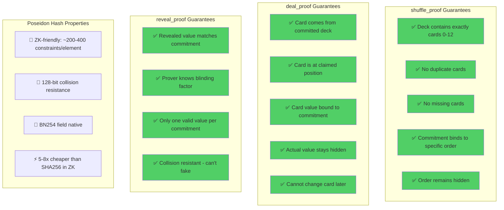

### Performance & Timing

```mermaid
gantt
    title Complete Game Timeline (Worst Case)
    dateFormat X
    axisFormat %s

    section Game Setup
    Generate seed & shuffle     :a1, 0, 1
    Compute deck commitment     :a2, after a1, 1
    Generate shuffle proof      :crit, a3, after a2, 1
    Create game tx              :a4, after a3, 2
    Verify shuffle tx           :a5, after a4, 2

    section Player Joins
    Join game tx                :b1, after a5, 2

    section Initial Deal
    Compute 10 commitments      :c1, after b1, 1
    Generate deal proof         :crit, c2, after c1, 1
    Deal hand tx                :c3, after c2, 2

    section Player Hits (x2)
    Player hit tx               :d1, after c3, 2
    Generate reveal proof       :crit, d2, after d1, 1
    Reveal card tx              :d3, after d2, 2
    Player hit tx               :d4, after d3, 2
    Generate reveal proof       :crit, d5, after d4, 1
    Reveal card tx              :d6, after d5, 2

    section Dealer Turn
    Reveal hole card proof      :crit, e1, after d6, 1
    Dealer play tx              :e2, after e1, 2
    Reveal hit card proof       :crit, e3, after e2, 1
    Dealer play tx              :e4, after e3, 2
    Determine winner            :e5, after e4, 1
```

| Stage | Operations | Time |
|-------|------------|------|
| **Game Creation** | Shuffle + proof + 2 txs | ~2s |
| **Player Join** | 1 tx | ~1s |
| **Initial Deal** | 10 commitments + proof + tx | ~2s |
| **Per Player Hit** | Reveal proof + tx | ~1s |
| **Dealer Turn** | 2-4 reveal proofs + txs | ~3s |
| **Total (worst case)** | Full game with multiple hits | **< 20 seconds** |

## Technology Stack 🛠️

### Frontend
- **Next.js 14** - React framework with App Router
- **Solana Web3.js** - Blockchain interaction
- **Wallet Adapter** - Phantom/Backpack support
- **TailwindCSS** - Utility-first styling
- **Framer Motion** - Animations
- **Lucide React** - Icons
- **Vercel** - Deployment platform
- **Helius** - High-performance Solana RPC & Webhooks

### Zero-Knowledge (ZK)
- **Noir** - Domain-specific language for ZK circuits
- **Barretenberg** - Proving backend (WASM)
- **Groth16** - Proof system (efficient on-chain verification)
- **Sunspot** - On-chain Groth16 verifier programs (Solana BPF)

### Smart Contracts
- **Anchor Framework** - Solana program development (Rust)
- **Solana Devnet** - Deployment network
- **Rust** - Smart contract language

### Privacy & Security
- **ShadowWire SDK** - Confidential token transfers (Bulletproofs)
- **Poseidon Hash** - ZK-friendly hashing algorithm

## Smart Contracts 📜

### Game Logic
**Program ID:** `22BfrTbAzVmwENnyfzk6rFtPaNvCmaATbeWaJKKoqkK4`

Handles the entire game lifecycle:
- `create_game()` - Initialize with deck commitment
- `join_game()` - Player joins
- `player_action()` - Hit/Stand/Double
- `reveal_card()` - Dealer reveals card value

### ZK Verifiers
Deployed verifier programs for proof validation:
- **Shuffle Verifier:** `5nFk288FuJQRqJhuNj4ZDkAdEjUYBYUE5g6SHkWPShbY`
- **Deal Verifier:** `2G5piXcJxMK7qjGkibFrB44GE3wu4ZHt876qYFR4tXtg`
- **Reveal Verifier:** `Eix22nAxj3WiGrEAxJoPjYMBTt3LMMYQQy79vWR3GDoo`

## ZK Circuits (The "Magic") 🧙‍♂️

ZK Card Arena uses three core circuits to ensure fairness:

### 1. **Shuffle Proof** (`shuffle_proof`)
```rust
Input: [13 card values, salt]
Output: deck_commitment (Poseidon Hash)
Proof: "I know a set of 13 cards that contains exactly one of each rank/suit, and this hash represents them."
```

### 2. **Deal Proof** (`deal_proof`)
```rust
Input: [deck, index, salt]
Output: card_commitment
Proof: "The card at this index in the committed deck has this specific commitment hash."
```

### 3. **Reveal Proof** (`reveal_proof`)
```rust
Input: [card_value, salt, commitment]
Output: public_value
Proof: "I am revealing a card value that matches the commitment hash you hold."
```

## Key Features Implementation 💻

### The "2-Step" Hit Flow
1.  **Player Request**: Player signs a transaction to "Hit". The program assigns the next *commitment* to them.
2.  **Dealer Reveal**: The dealer's client observes the request and submits a **Reveal Transaction** with a ZK proof.
    *   *Why?* This prevents the player from seeing the card before committing to the action, and prevents the dealer from changing the card after the action.

### ShadowWire Integration
- **Private Bets**: Players can deposit tokens into a privacy pool.
- **Confidential Settlements**: Winnings are transferred without revealing the amount or recipient on the public ledger.

## Hackathon Tracks & Bounties 🏆

We are targeting the following tracks in the **Solana Privacy Hack**:

| Track | Prize | Goal | Implementation |
| :--- | :--- | :--- | :--- |
| **Open Track** (Solana Foundation) | **$18,000** | Build a privacy-preserving application on Solana. | We built a full-stack dApp that uses ZK proofs to hide card values and **ShadowWire** to hide transaction amounts. It solves a real-world problem (trust in casinos) using privacy tech. |
| **Aztec / Noir** (ZK Circuits) | **$10,000** | Use Noir to build a ZK application. | We wrote **3 custom Noir circuits** (`shuffle`, `deal`, `reveal`) and deployed **3 Groth16 verifiers** on-chain using Sunspot. The entire game logic relies on these circuits for fairness. |
| **Radr Labs** (ShadowWire) | **$15,000** | Private Transfers with ShadowWire (Hide transaction amounts using Bulletproofs). | We integrated the **ShadowWire SDK** to enable private betting. Players deposit funds, and transaction amounts are hidden using **Bulletproofs** (ZK proofs) while remaining verifiable on-chain. We utilize **Client-Side Proof Generation (WASM)** for maximum privacy. |


## Important Files 📍

### Frontend Logic
- **Game Page**
  `/pages/game.js`

- **ZK Hook**
  `/hooks/useZKGame.js`

- **Program Hook**
  `/hooks/useGameProgram.js`

### Smart Contracts
- **Game Program**
  `/programs/zk-card-arena/src/lib.rs`

### ZK Circuits
- **Shuffle Circuit**
  `/circuits/shuffle/src/main.nr`

- **Reveal Circuit**
  `/circuits/reveal/src/main.nr`

## Project Structure 📁

```
umbra/
├── programs/               # Anchor smart contracts
│   └── zk-card-arena/      # Main game logic
├── circuits/               # Noir ZK circuits
│   ├── shuffle/            # Shuffle logic
│   ├── deal/               # Card commitment logic
│   └── reveal/             # Card reveal logic
├── pages/                  # Next.js pages
│   └── game.js             # Main game UI & logic
├── components/             # React components
├── hooks/                  # Custom hooks (Solana + ZK)
│   ├── useGameProgram.js   # Anchor interactions
│   └── useZKGame.js        # ZK proof generation
└── docs/                   # Documentation
```

## Testing Guide 🧪

### Test Flow

1.  **Create Game**
    - Click "Create Game" as Dealer.
    - Wait for ZK Shuffle Proof generation (~30s).
    - Confirm transaction.

2.  **Join Game**
    - Open a new browser window (Incognito).
    - Enter the Game ID from the dealer's screen.
    - Click "Join Game".

3.  **Play Hand**
    - Dealer clicks "Deal".
    - Player clicks "Hit" or "Stand".
    - Watch the ZK proofs verify on-chain!

## Deployment 🚢

### Frontend (Vercel)
```bash
npm run build
# Deploy to Vercel
```

### Smart Contracts (Solana Devnet)
```bash
anchor build
anchor deploy --provider.cluster devnet
```

