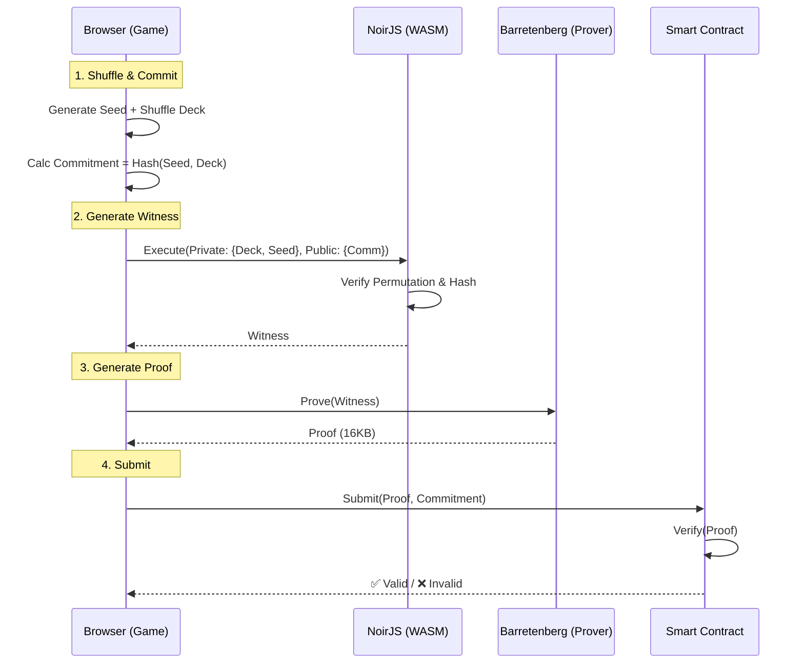
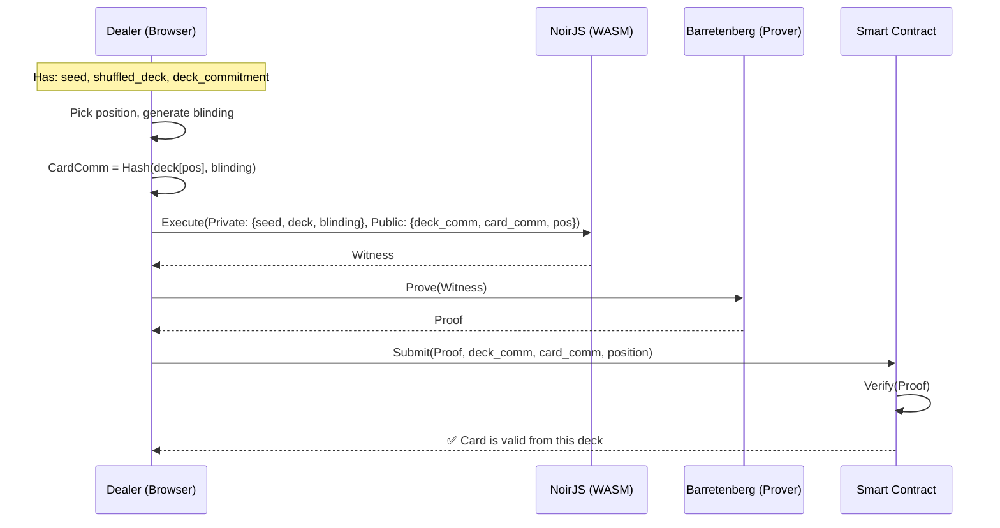
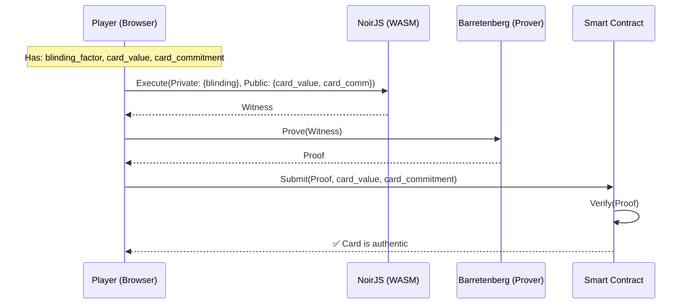

# ZK Proof Flows

**Status:** All 3 circuits implemented & verified (Day 3)

---

# 1. Shuffle Flow

**Circuit:** `circuits/shuffle_proof/src/main.nr`

---

## 1. Setup Phase (Browser)
The user's browser loads:
- **NoirJS & bb.js** (WASM libraries)
- **Compiled Circuit** (`shuffle_proof.json`)
- **Verification Key** (for self-verification)

---

## 2. Shuffle & Commit (Client-Side)
Before touching ZK, the game logic performs the shuffle:

1. **Generate Seed:** Random 256-bit field element.
2. **Shuffle Deck:** Randomly permute cards `[0..12]`.
   - *Example:* `[5, 2, 11, 0, ...]`
3. **Calculate Commitment:**
   - `Comm = Poseidon(seed, shuffled_deck)`
   - This `Comm` is public; the deck order remains **private**.

---

## 3. Witness Generation (NoirJS)
The browser executes the circuit logic to create a "witness" (execution trace).

**Inputs:**
- **Private:** `seed`, `shuffled_deck`
- **Public:** `deck_commitment`, `original_deck`

**Circuit Logic:**
1. **Permutation Check:** Asserts `shuffled_deck` contains every card from `original_deck` exactly once.
2. **Commitment Check:** Asserts `Poseidon(seed, shuffled_deck) == deck_commitment`.

*Result:* A valid witness file (intermediate binary).

---

## 4. Proof Generation (Barretenberg)
The `bb.js` backend takes the witness and generates the cryptographic proof.

- **Process:** UltraHonk Proving
- **Time:** ~0.64s (Browser)
- **Output:** `proof` (16KB byte array)

---

## 5. Verification (On-Chain / Peer)
The proof is sent to the verifier (Smart Contract or Opponent).

**Verifier Inputs:**
- `proof`
- `deck_commitment` (Public Input)
- `original_deck` (Public Input)

**Check:**
- Does `proof` validly demonstrate that the prover knows a `seed` and `shuffled_deck` that match `deck_commitment` AND form a valid permutation?

*Result:* ✅ **VALID** or ❌ **INVALID**

---

## Diagram

---

# 2. Deal Flow

**Circuit:** `circuits/deal_proof/src/main.nr`

## Purpose
Prove that a specific card at a given position comes from the previously committed deck, without revealing any other cards.

---

## 1. Deal Setup (Client-Side)
After shuffle is committed, the dealer needs to deal cards:

1. **Select Position:** Choose card position (0-12) in the shuffled deck.
2. **Generate Blinding:** Random field element to hide the card value.
3. **Calculate Card Commitment:**
   - `CardComm = Poseidon(shuffled_deck[position], blinding_factor)`
   - The card value is hidden behind this commitment.

---

## 2. Witness Generation (NoirJS)

**Inputs:**
- **Private:** `seed`, `shuffled_deck`, `blinding_factor`
- **Public:** `deck_commitment`, `card_commitment`, `card_position`

**Circuit Logic:**
1. **Deck Check:** Poseidon(seed, shuffled_deck) == deck_commitment (same deck as shuffle)
2. **Position Check:** card_position is valid (0-12)
3. **Card Commitment Check:** Poseidon(deck[position], blinding) == card_commitment

---

## 3. Proof Generation & Verification

- **Time:** ~0.18s (Native)
- **Constraints:** 1,111
- **Output:** Proof that a hidden card belongs to the committed deck

**Verifier confirms:**
- The card commitment links to the same deck that was shuffled
- The prover knows the card at that position

---

## Diagram

---

# 3. Reveal Flow

**Circuit:** `circuits/reveal_proof/src/main.nr`

## Purpose
At game end, reveal the actual card value and prove it matches the commitment made during dealing.

---

## 1. Reveal Setup (Client-Side)
When a card needs to be revealed (game end, showdown):

1. **Recall Blinding:** Use the same blinding_factor from the deal phase.
2. **Provide Card Value:** The actual card (0-12).
3. **Card Commitment:** Same commitment from the deal phase.

---

## 2. Witness Generation (NoirJS)

**Inputs:**
- **Private:** `blinding_factor`
- **Public:** `card_value`, `card_commitment`

**Circuit Logic:**
1. **Range Check:** card_value is valid (0-12)
2. **Commitment Check:** Poseidon(card_value, blinding_factor) == card_commitment

---

## 3. Proof Generation & Verification

- **Time:** ~0.011s (Native)
- **Constraints:** 333
- **Output:** Proof that the revealed card matches the earlier commitment

**Verifier confirms:**
- The revealed card value was the same one committed during dealing
- No card substitution occurred

---

## Diagram

---

# 4. Full Game Flow

Shows all 3 proofs in sequence during a complete game.

```mermaid
sequenceDiagram
    participant D as Dealer
    participant Chain as Solana
    participant P as Player

    Note over D,P: === GAME START ===

    rect rgb(40, 40, 80)
    Note over D: Phase 1: Shuffle
    D->>D: Generate seed, shuffle deck
    D->>D: deck_comm = Hash(seed, deck)
    D->>D: Generate shuffle_proof
    D->>Chain: Submit(shuffle_proof, deck_comm)
    Chain->>Chain: Verify shuffle_proof ✅
    end

    rect rgb(40, 80, 40)
    Note over D: Phase 2: Deal (repeat per card)
    D->>D: Pick position, generate blinding
    D->>D: card_comm = Hash(deck[pos], blinding)
    D->>D: Generate deal_proof
    D->>Chain: Submit(deal_proof, deck_comm, card_comm, pos)
    Chain->>Chain: Verify deal_proof ✅
    Chain-->>P: card_commitment (hidden card)
    end

    rect rgb(80, 40, 40)
    Note over D,P: Phase 3: Reveal (game end)
    D->>D: Generate reveal_proof
    D->>Chain: Submit(reveal_proof, card_value, card_comm)
    Chain->>Chain: Verify reveal_proof ✅
    Chain-->>P: card_value revealed!
    P->>P: Verify: card matches commitment from deal phase
    end

    Note over D,P: === GAME END: Fair result verified ===
```

