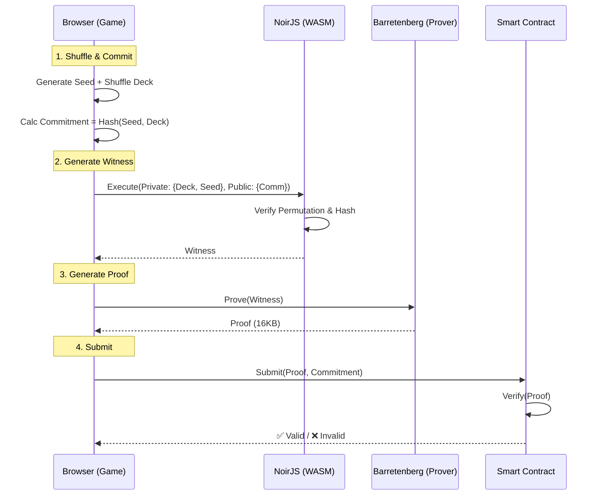

# ZK Shuffle Flow (Current Implementation)

**Status:** Implemented & Verified (Day 2)
**Circuit:** `circuits/src/main.nr`

---

## 1. Setup Phase (Browser)
The user's browser loads:
- **NoirJS & bb.js** (WASM libraries)
- **Compiled Circuit** (`shuffle_proof.json`)
- **Verification Key** (for self-verification)

---

## 2. Shuffle & Commit (Client-Side)
Before touching ZK, the game logic performs the shuffle:

1. **Generate Seed:** Random 256-bit field element.
2. **Shuffle Deck:** Randomly permute cards `[0..12]`.
   - *Example:* `[5, 2, 11, 0, ...]`
3. **Calculate Commitment:**
   - `Comm = Poseidon(seed, shuffled_deck)`
   - This `Comm` is public; the deck order remains **private**.

---

## 3. Witness Generation (NoirJS)
The browser executes the circuit logic to create a "witness" (execution trace).

**Inputs:**
- **Private:** `seed`, `shuffled_deck`
- **Public:** `deck_commitment`, `original_deck`

**Circuit Logic:**
1. **Permutation Check:** Asserts `shuffled_deck` contains every card from `original_deck` exactly once.
2. **Commitment Check:** Asserts `Poseidon(seed, shuffled_deck) == deck_commitment`.

*Result:* A valid witness file (intermediate binary).

---

## 4. Proof Generation (Barretenberg)
The `bb.js` backend takes the witness and generates the cryptographic proof.

- **Process:** UltraHonk Proving
- **Time:** ~0.64s (Browser)
- **Output:** `proof` (16KB byte array)

---

## 5. Verification (On-Chain / Peer)
The proof is sent to the verifier (Smart Contract or Opponent).

**Verifier Inputs:**
- `proof`
- `deck_commitment` (Public Input)
- `original_deck` (Public Input)

**Check:**
- Does `proof` validly demonstrate that the prover knows a `seed` and `shuffled_deck` that match `deck_commitment` AND form a valid permutation?

*Result:* ✅ **VALID** or ❌ **INVALID**

---

## Diagram

